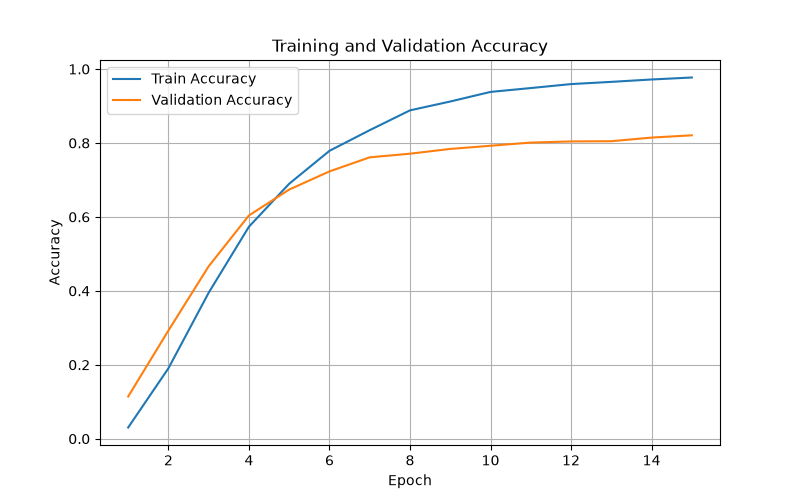
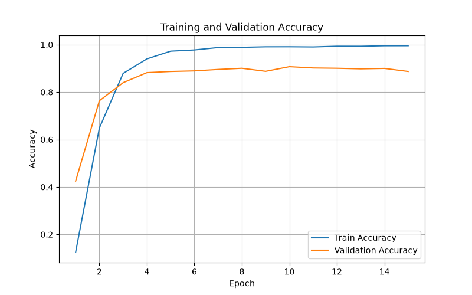
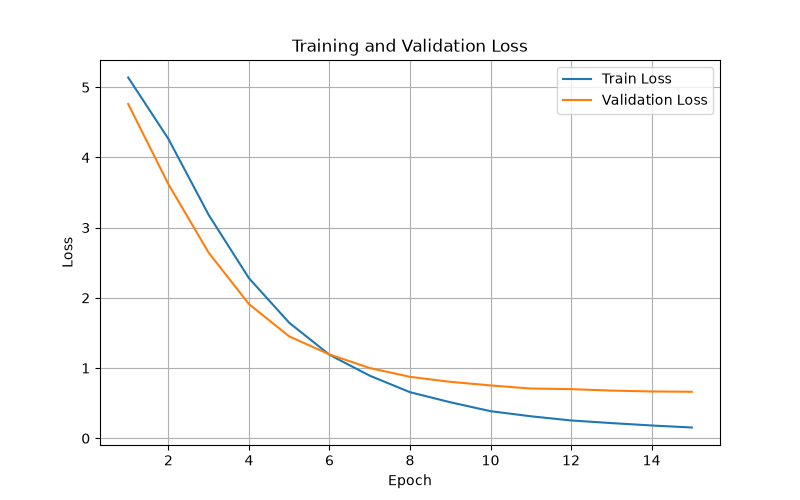
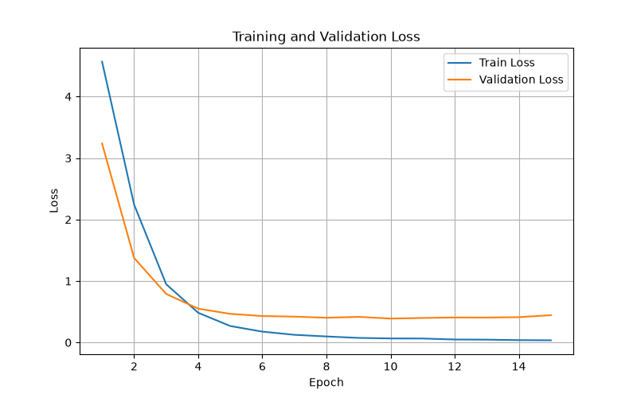
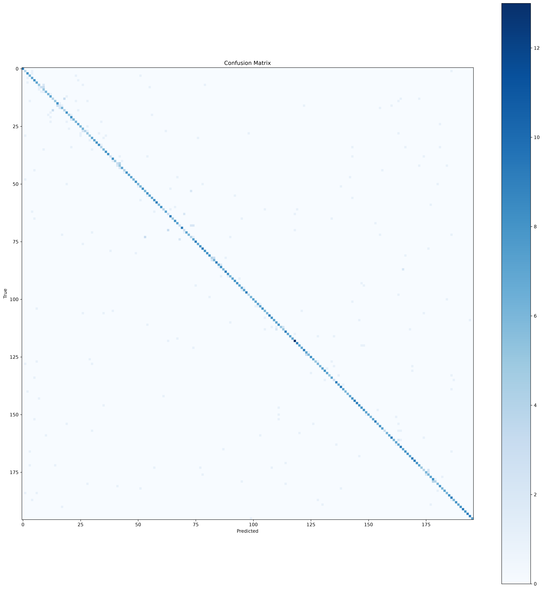
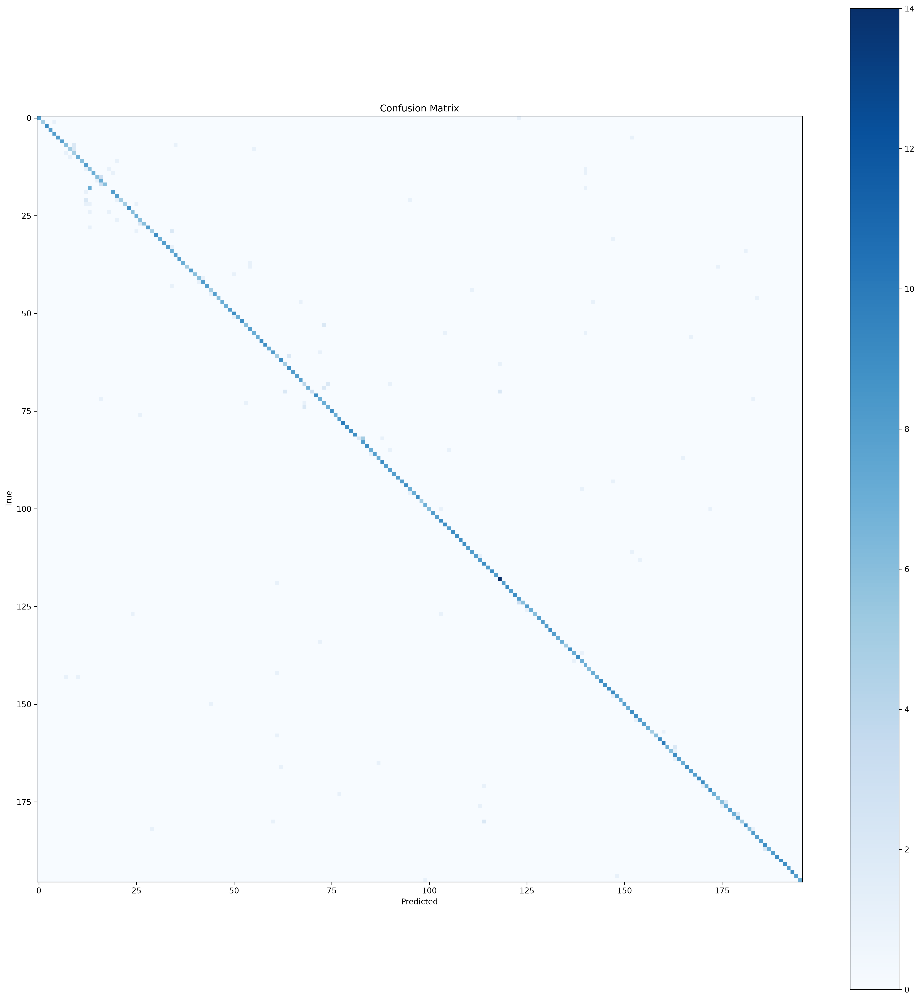

# 🚗 Fine-Grained Image Classification with PyTorch

A deep learning project for **fine-grained vehicle classification** on the **Stanford Cars** dataset using **EfficientNet-B0** and **ConvNeXt-Tiny**. This project compares two modern convolutional neural network architectures under the same training pipeline and provides a complete framework for training, evaluation, visualization, and performance analysis.

---

## 📌 Features

* ✅ Fine-grained image classification on the Stanford Cars dataset
* ✅ PyTorch implementation
* ✅ Supports EfficientNet-B0 and ConvNeXt-Tiny
* ✅ Transfer Learning with ImageNet pretrained weights
* ✅ Training and validation pipeline
* ✅ Evaluation metrics

  * Accuracy
  * Precision
  * Recall
  * F1-score
  * Top-5 Accuracy
* ✅ Confusion Matrix generation
* ✅ Classification Report (.csv)
* ✅ Training history logging
* ✅ Accuracy & Loss visualization

---

## 📊 Dataset

This project uses the **Stanford Cars Dataset**.

* **196** car categories
* **8,144** training images
* **8,041** testing images

Dataset Website:

https://www.kaggle.com/datasets/eduardo4jesus/stanford-cars-dataset

---

## 🧠 Models

Two pretrained models are implemented and compared.

### EfficientNet-B0

* Transfer Learning
* ImageNet pretrained weights
* AdamW optimizer

### ConvNeXt-Tiny

* Transfer Learning
* ImageNet pretrained weights
* AdamW optimizer

---

## ⚙️ Training Configuration

| Parameter         |            Value |
| ----------------- | ---------------: |
| Framework         |          PyTorch |
| Optimizer         |            AdamW |
| Loss Function     | CrossEntropyLoss |
| Batch Size        |               32 |
| Image Size        |        224 × 224 |
| Number of Classes |              196 |
| Pretrained        |   Yes (ImageNet) |

---

## 📈 Performance

| Model           | Best Validation Accuracy |    F1-score |
| --------------- | -----------------------: | ----------: |
| EfficientNet-B0 |               **82.07%** |  **81.64%** |
| ConvNeXt-Tiny   |               **90.73%** | **90.47%** |

---

## 📊 Evaluation

The evaluation pipeline computes:

* Accuracy
* Precision
* Recall
* F1-score
* Top-5 Accuracy
* Confusion Matrix
* Classification Report

---

## ⚙️ Installation

Clone this repository:

```bash
git clone https://github.com/MahdisHassani/fine-grained-image-classification-pytorch.git
cd fine-grained-image-classification-pytorch
```

Install dependencies:

```bash
pip install -r requirements.txt
```

---

## 🚀 Training

```bash
python train.py
```

---

## 📈 Evaluation

```bash
python evaluate.py
```

---

## 📷 Example Results

The following figures compare the training behavior and evaluation performance of **EfficientNet-B0** and **ConvNeXt-Tiny** on the Stanford Cars dataset.

### 📈 Training Accuracy

|                          EfficientNet-B0                         |                       ConvNeXt-Tiny                      |
| :--------------------------------------------------------------: | :------------------------------------------------------: |
|  |  |

---

### 📉 Training Loss

|                      EfficientNet-B0                     |                   ConvNeXt-Tiny                  |
| :------------------------------------------------------: | :----------------------------------------------: |
|  |  |

---

### 🔍 Confusion Matrix

|                               EfficientNet-B0                              |                            ConvNeXt-Tiny                           |
| :------------------------------------------------------------------------: | :----------------------------------------------------------------: |
|  |  |
